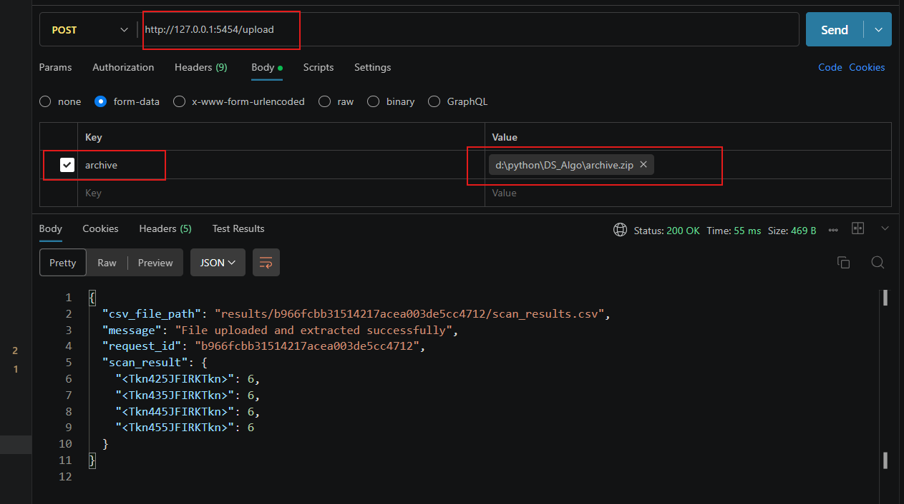
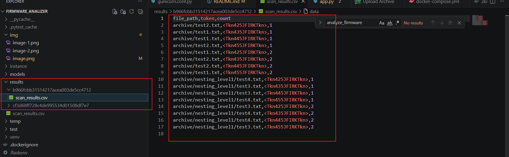
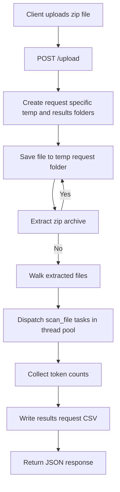

# To run and test the code locally follow the steps - 

## Make environment setup - 

create a file named .flaskenv for setting environment variables
although the DB is not used in this task because the result was supposed to be saved in CSV file, i have added DB just for future reference

add the following values in the .flaskenv file - 

* FLASK_APP = app
* FLASK_DEBUG =1
* DB_USER = firmware_analizer
* DB_PASSWORD = <db_password>
* BD_HOST = db
* DB_NAME = <db_name>
* POSTGRES_USER = <postgres_user>
* POSTGRES_PASSWORD = <postgress_password>
* POSTGRES_DB = <postgress_db_name>
* POSTGRES_HOST = db
* DATABASE_URL = postgresql://<DB_USER>:<DB_PASSWORD>@<BD_HOST>/<DB_NAME>
* WEB_CONCURRENCY = 2
* SCAN_WORKERS = 4
* GUNICORN_TIMEOUT = 120

## Build 
docker-compose up --build

## Shut down 

docker-compose down

## Test using API testing software, in this case i used postman

* Make a temporary zip file which might have nested zip, it should have files which have tokens of format "Tkn435JFIRKTkn"
* Starting with"<Tkn" then later 3 digits, 5 English capital letters followed by a "Tkn>". 
For example: "Tkn435JFIRKTkn". 
* Now create a new post request for path "/upload" in postman and pass the archive(zip file) in the body, give the key name as "archive" and pass the file path as value
* 
* you will get the scan result in the output 
* each upload gets its own request id, temporary folder under `temp/<request_id>/`, and CSV output under `results/<request_id>/scan_results.csv`
* ![alt text]

## To run testcases follow the below commands

move to the test folder - "cd test"
run - "pytest -s -v test_app.py"

## Architecture

This project is a small Flask-based firmware archive analyzer.

### Main components

* `app.py`
	* Creates the Flask application.
	* Exposes the `POST /upload` API.
	* Creates a unique request id for every upload.
	* Saves the uploaded archive into a request-specific folder under `temp/`.
	* Extracts the archive recursively, including nested zip files.
	* Scans extracted files for tokens matching the pattern `<Tkn\d{3}[A-Z]{5}Tkn>`.
	* Aggregates token counts and writes detailed scan rows into `results/<request_id>/scan_results.csv`.
	* Uses `ThreadPoolExecutor` so file scans can run in parallel without creating extra worker processes per request.

* `db.py`
	* Initializes the SQLAlchemy database object.
	* Database wiring exists for future extension, although the current implementation stores scan output in CSV instead of persisting scan results in the database.

* `temp/`
	* Temporary working directory for uploaded zip files and extracted content.
	* Each request gets its own subdirectory so concurrent uploads do not overwrite each other.

* `results/`
	* Stores generated CSV output in per-request subdirectories.

* `test/`
	* Contains pytest-based tests for upload, extraction, and scan result behavior.

### Request flow

1. A client sends a `POST /upload` request with a multipart file field named `archive`.
2. The app validates the uploaded file name and creates a unique working directory for the request.
3. The app saves the archive under `temp/<request_id>/`.
4. The app extracts the archive contents.
5. If nested zip files are found, they are extracted recursively.
6. The extracted directory is scanned file by file.
7. Each file is processed in parallel by `scan_file(...)` using a thread pool.
8. Matching tokens are counted and merged into the final response.
9. Detailed per-file scan rows are written to `results/<request_id>/scan_results.csv`.
10. The API returns JSON containing a success message, the request id, the CSV path, and aggregated token totals.

### High-level flow

### Current design

* The application currently has a single API endpoint and performs scanning synchronously within the request lifecycle.
* The database is configured but not used for storing scan results yet.
* The current output is split into two forms:
	* API response with aggregated token totals.
	* CSV file with per-file token details.
