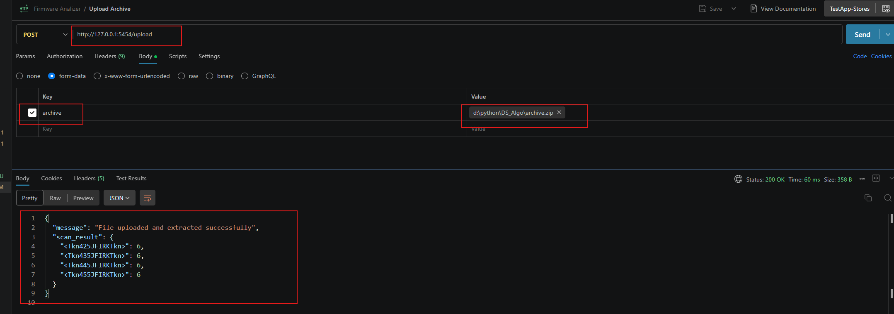
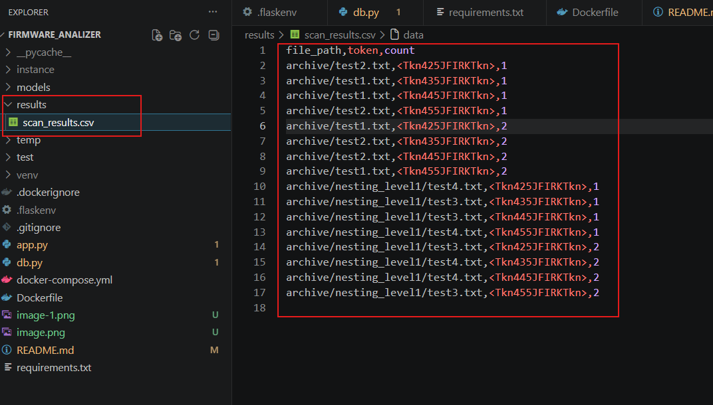

# To run and test the code locally follow the steps - 

## Make environment setup - 

create a file named .flaskenv for setting environment variables
although the DB is not used in this task because the result was supposed to be saved in CSV file, i have added DB just for future reference

add the following values in the .flaskenv file - 

* FLASK_APP = app
* FLASK_DEBUG =1
* DB_USER = firmware_analizer
* DB_PASSWORD = <password>
* BD_HOST = db
* DB_NAME = <db_name>
* POSTGRES_USER = <postgres_user>
* POSTGRES_PASSWORD = <postgress_password>
* POSTGRES_DB = <postgress_db_name>
* POSTGRES_HOST = db
* DATABASE_URL = postgresql://<DB_USER>:<DB_PASSWORD>@<BD_HOST>/<DB_NAME>

## Build 
docker-compose up --build

## Shut down 

docker-compose down

## Test using API testing software, in this case i used postman

* Make a temporary zip file which might have nested zip, it should have files which have tokens of format "Tkn435JFIRKTkn"
* Starting with"<Tkn" then later 3 digits, 5 English capital letters followed by a "Tkn>". 
For example: "Tkn435JFIRKTkn". 
* Now create a new post request for path "/upload" in postman and pass the archive(zip file) in the body, give the key name as "archive" and pass the file path as value
* 
* you will get the scan result in the output 
* you can also see the CSV file in path - "results/"
* 
